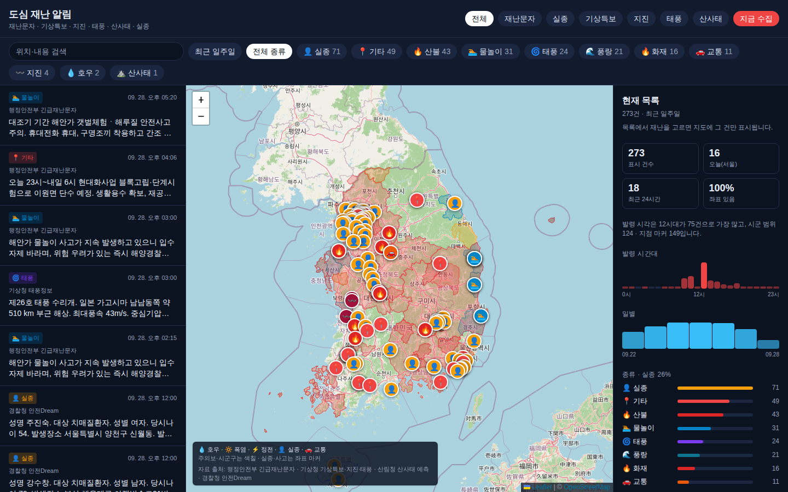
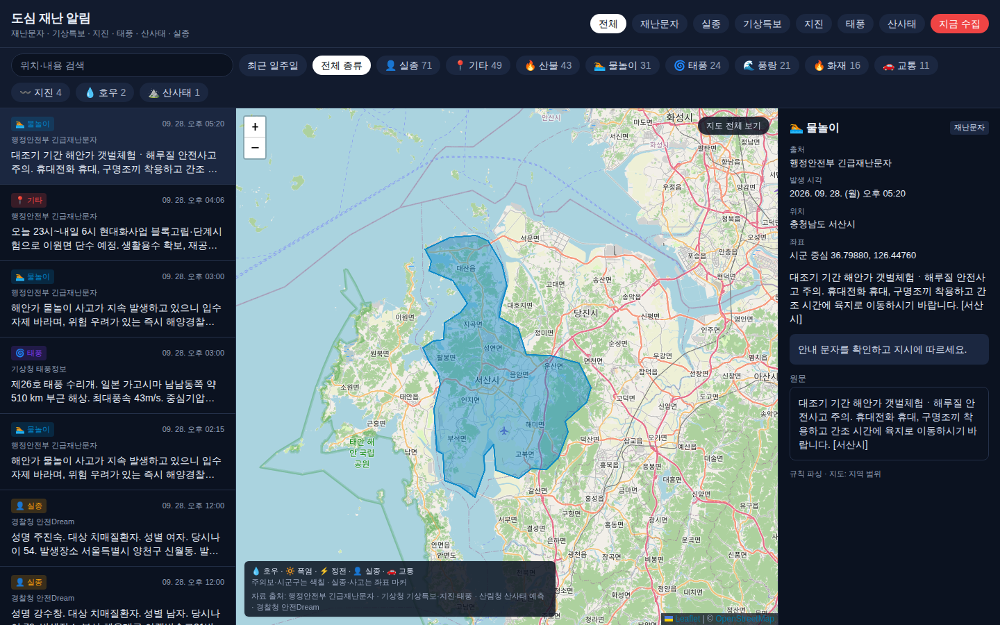

# 도심 재난 알림

공공 재난문자·기상특보·실종 정보를 모아, 원문에서 위치를 판별한 뒤 지도에 표시한다. 시민 제보는 대상에 넣지 않으며, 실종자 사진은 분석에 쓰지 않고 문자 원문만 이용한다.

  

기본 화면. 서울 시각 기준 최근 7일, 목록·지도·통계.

## 화면

왼쪽은 발령 목록, 가운데는 지도, 오른쪽은 현재 목록의 통계다. 시·군 단위 주의보·경보는 행정구역을 색칠하고, 실종·사고처럼 지점이 특정된 건은 마커로 찍는다. 종류·출처·기간으로 걸러 볼 수 있다.

건을 고르면 지도는 그 건만 남기고, 오른쪽은 원문·위치·안내로 바뀐다.

  

한 건을 고른 화면. 해당 시·군 범위와 원문.

## 자료

| 출처 | 내용 |
| --- | --- |
| 행정안전부 긴급재난문자 | 재난안전데이터공유플랫폼 API. 생성일(`crtDt`) 단위라 운영 수집은 당일·전일분이다. 2023년 9월부터의 공개 목록은 아카이브로 보완했다. |
| 기상청 | 발효 중인 기상특보, 지진·태풍 정보. 해상 구역은 육지 행정구역으로 매핑하지 않는다. |
| 산림청 | 산사태 예측 정보 |
| 경찰청 안전Dream | 실종 정보. 사진은 쓰지 않는다. |

기간 조회는 서울 시각 기준 시작일·종료일의 닫힌 구간이다.

## 위치 판별

생성형 모형만 쓰면 발신 지역과 무관한 지명이 섞인다. 아래 순서로 위치를 정한다.

1. `[진주시]`처럼 발신 기관명을 행정구역으로 읽어 탐색 범위를 고정한다.
2. 법정동 사전으로 시·도, 시·군·구, 읍·면·동, 리를 대조한다.
3. 도로명과 건물번호가 있으면 지오코딩으로 좌표를 구하고, 실패하면 해당 시·군 중심점에 둔다.
4. 사전이 부족할 때만 개체명 인식과 언어 모형으로 지명을 보완한다.

리·면은 일반 명사·어미와 겹친다. `역류하면`, `요구하면` 같은 동사 활용, `구제역`을 역으로 읽는 경우, 교차로명(`…사거리`)에서 역만 남는 경우는 규칙으로 뺀다. 실제 행정구역인 `상하면` 등은 사전에 있으면 유지한다. 발신 지자체와 시·군이 모순되는 후보는 버린다.

## 재난 유형

원문 키워드의 우선순위로 종류를 붙인다. 호우·폭염·태풍 등 기상 특보 표현이 있으면 그 유형을 택하고, 댐 방류나 수위 안내만으로는 호우로 보지 않는다. 강풍 주의보·경보는 강풍으로 둔다. 서행 지시만으로 교통 사고로 분류하지 않으며, 폭발이라는 어휘만으로 화재로 보지 않는다. 구제역 발령은 축산 방역으로 둔다.

요약과 행동 안내는 유형별 규칙 문장으로 만든다.

## 구성

Next.js 15 · React · Leaflet 지도 · SQLite. 수집·파싱·지오코딩은 서버에서 하고, 화면은 목록과 지도를 같이 보여 준다.
